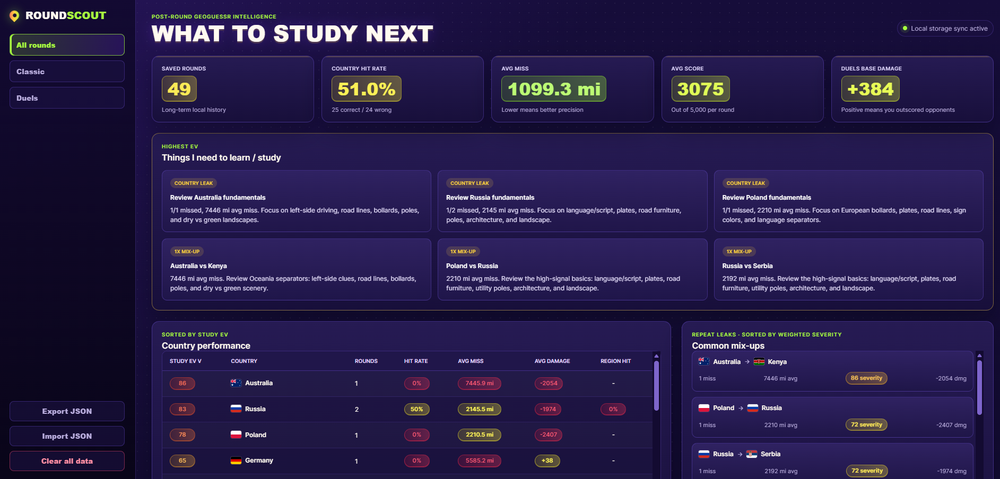
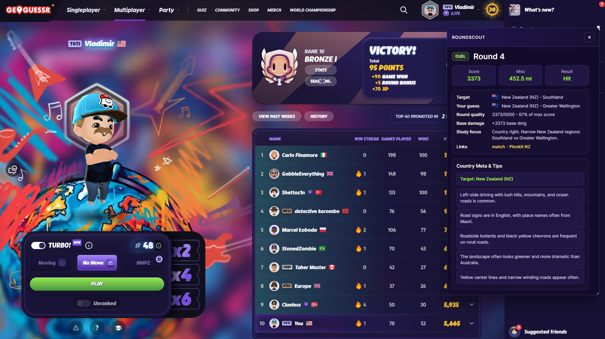
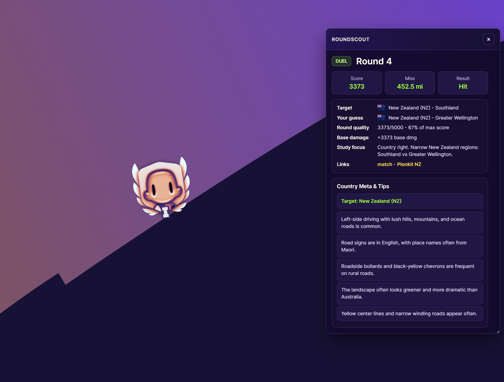

# RoundScout for GeoGuessr

Free post-round GeoGuessr learning extension for beginners who want to understand their mistakes instead of just moving on to the next round.

RoundScout is a free browser extension I built to make GeoGuessr easier to learn after each round.

It does **not** help while you are guessing. It waits until GeoGuessr shows the answer, then opens a small study popup with the country, your guess, score, miss distance, region info, and a visual lesson for the exact country pair.

It also saves your rounds locally so you can see what you keep missing and what is actually worth studying next.

## Why I Built This

When I was learning GeoGuessr, I kept running into the same problem:

I would finish a round, see the right country, think "ah okay", and then immediately forget what I was supposed to learn from it.

RoundScout is meant to fix that. After a round, it quickly answers:

- What country was it?
- What did I guess?
- Was I right?
- How far off was I?
- Was it a country mistake or just a region mistake?
- What beginner clues should I remember for next time?
- What countries do I keep mixing up?
- What should I study first if I want the biggest improvement?

## What It Looks Like

### Post-round popup

The popup appears after the result is revealed and gives you the useful stuff right away.

### Clean post-round view

You can drag and resize it, close it, or open the full stats page.

## Main Features

- Post-round study popup for Classic and Duels.
- Country detection after the answer is revealed.
- Saved round history with target country, guessed country, score, distance, regions, and Duel base damage.
- Pair-specific visual debriefs that compare the target with your guess.
- Structured beginner clues for language, driving side, plates, road markings, signs, bollards, utility poles, Google car, architecture, and landscape.
- Matched guide images: every image stays attached to the clue it actually explains.
- Plonkit links for deeper learning.
- Country performance breakdown.
- Repeat mix-ups, like "Australia guessed as Kenya".
- "Things I need to learn / study" section that turns your mistakes into a study list.
- Local JSON export/import for backups.
- Everything is saved locally in your browser. No backend.

## What It Does Not Do

RoundScout is not meant to be a cheat tool.

- It should not show country tips during active guessing.
- It does not send your stats to a server.
- It does not require an account.
- It is not affiliated with GeoGuessr or Plonkit.

## Install

RoundScout is currently an unpacked browser extension.

1. Download or clone this repo.
2. Open `edge://extensions` or `chrome://extensions`.
3. Turn on **Developer mode**.
4. Click **Load unpacked**.
5. Select the RoundScout folder.
6. Open GeoGuessr and play normally.

The stats page opens from the extension icon or from the popup.

## How To Use It

Play GeoGuessr like normal.

After a round ends, RoundScout opens a small popup. Start with the visual debrief: it prioritizes the clue categories that best separate the target from your guess. Expand **More beginner clues** when you want extra context.

Visual examples are loaded from the matching public Plonkit country guide, cached locally for faster repeat lessons, and linked back to their source. RoundScout does not bundle Plonkit's image library. Israel, which currently has no Plonkit guide, uses clearly attributed freely licensed Wikimedia Commons examples.

After a few games, open the stats dashboard. The most useful areas are:

- **Things I need to learn / study**: the fastest study targets based on your mistakes.
- **Country performance**: countries sorted by study value, not just alphabetically.
- **Common mix-ups**: countries you keep confusing.
- **Saved rounds**: the raw history, with a remove button for mistakes.

## Support

RoundScout is free. If it helps you learn GeoGuessr and you want to support the project, you can buy me a coffee here:

[Buy me a coffee](https://buymeacoffee.com/vladvladvlad)

No pressure at all. I made this because I wanted a better way to learn, and I hope it helps other people too.

## Privacy

RoundScout stores saved rounds with `chrome.storage.local`. That means the data stays in your browser unless you export it.

To identify countries and regions, RoundScout sends revealed round coordinates to BigDataCloud's public reverse-geocoding endpoint. Visual debriefs request the public Plonkit pages for the target country and, when useful, the country you guessed. These requests do not include your GeoGuessr account, saved history, score, or personal stats.

If you uninstall the extension, browser extension storage may be removed too. Use **Export JSON** if you want a backup.

## Development

No build step is needed.

Run `npm test` to check the clue engine, image/text matching, country coverage, and manifest. Run `npm run preview`, then open `http://127.0.0.1:8765/tests/visual-debrief.html`, to inspect the visual debrief without starting a GeoGuessr game.

After editing files:

1. Go back to `edge://extensions` or `chrome://extensions`.
2. Click reload on RoundScout.
3. Refresh GeoGuessr.

## Files

- `manifest.json` - extension setup.
- `src/page-probe.js` - listens for GeoGuessr game data.
- `src/content.js` - popup, round tracking, saving logic.
- `src/background.js` - extension messages and storage merge.
- `src/data.js` - country tips.
- `src/clues.js` - structured clue categories and pair-specific lesson ranking.
- `src/guide-parser.js` - extracts matched visual clue previews from public guide pages.
- `src/stats.html`, `src/stats.css`, `src/stats.js` - stats dashboard.
- `src/styles.css` - popup styling.
